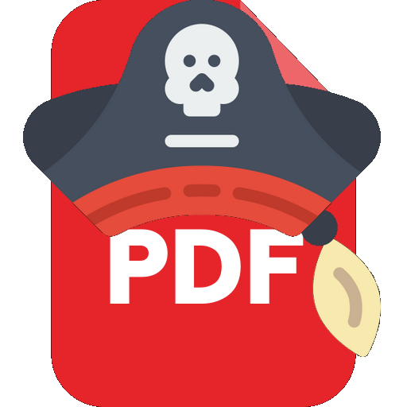

# 🧾 PDF OCR Translate Tool

> Un outil complet de reconnaissance de texte (OCR), de traduction, et d'édition de zones personnalisées sur des documents PDF.



## 🚀 Fonctionnalités principales

- 🔍 OCR multilingue via [Tesseract](https://github.com/tesseract-ocr/tesseract)
- 🌐 Traduction automatique via [Deep Translator (Google Translate)](https://pypi.org/project/deep-translator/)
- ✏️ Édition manuelle de zones OCR par page
- 💾 Export vers PDF stylisé avec superposition de texte
- 🎨 Thème clair / sombre personnalisable
- 📂 Ouverture automatique du dossier d’export
- 📌 Déplacement de zones avec les flèches du clavier
- ✅ Mode multi-zones toggleable
- 💬 Support multilingue pour l’OCR et la traduction

---

## 🧰 Technologies utilisées

- `Python 3.12+`
- `PyMuPDF (fitz)`
- `pytesseract`
- `ocrmypdf`
- `deep_translator`
- `PIL / Pillow`
- `CustomTkinter`
- `pikepdf`
- `playsound`

---

## 🐍 Utiliser Python

Ce projet est développé en Python. Si vous ne l'avez pas encore installé, voici comment faire :

### 🧑‍💻 Installation de Python

1. 🌐 Rendez-vous sur [https://www.python.org/downloads/](https://www.python.org/downloads/)
2. ⬇️ Téléchargez la version recommandée pour votre système (Windows, macOS, Linux)
3. ✅ Pendant l'installation, cochez la case : `Add Python to PATH`
4. 🧪 Vérifiez que Python est bien installé en ouvrant un terminal et tapant :
   ```bash
   python --version
   ```

---

## 📦 Installation

1. **Cloner le dépôt** :
   ```bash
   git clone https://github.com/ton-utilisateur/pdf-ocr-translate.git
   cd pdf-ocr-translate
   ```

2. **Créer un environnement virtuel (optionnel mais recommandé)** :
   ```bash
   python -m venv myenv
   source myenv/bin/activate  # Linux/macOS
   myenv\Scripts\activate     # Windows
   ```

3. **Installer les dépendances** :
   ```bash
   pip install -r requirements.txt
   ```

4. **Installer Tesseract-OCR** :
   - Télécharger depuis : https://github.com/tesseract-ocr/tesseract
   - Installer dans un dossier `Tesseract-OCR/` à la racine du projet
   - Ne pas oublier d'installer les langues nécessaires (`.traineddata`)

---

## 📁 Structure du projet

```
<<<<<<< HEAD
pdf_ocr_translate/
│
├── icon/                # Icônes de l'application
├── flags/               # Drapeaux pour les langues
├── conf/                # Configuration utilisateur
├── trads/               # Fichiers PDF traduits (output)
├── modules/
│   ├── zone_editor_test.py   # Éditeur OCR personnalisé
│   ├── theme_manager.py      # Gestion du thème global
│   └── path_util.py          # Compatibilité PyInstaller
│
├── pdf_translate.py     # Fichier principal de lancement (UI)
├── requirements.txt     # Fichier pip (à générer)
└── README.md            # Ce fichier
=======
deep-translator
customtkinter
pymupdf
ocrmypdf
pillow
pytesseract
pikepdf
psutil 
```

### 🛠 Outils externes nécessaires

| Outil | Rôle | Lien / Emplacement |
|-------|------|--------------------|
| **Tesseract** | OCR principal | https://github.com/tesseract-ocr/tesseract |
| **Poppler**   | Convertir PDF en images | https://github.com/oschwartz10612/poppler-windows |
| **Ghostscript** | Traitement PDF | https://www.ghostscript.com/ |
| **pngquant** *(optionnel)* | Optimisation image | https://pngquant.org/ |

⚠ Assurez-vous que les exécutables sont dans le `PATH` ou définis manuellement dans le script via :

```python
os.environ["PATH"] += os.pathsep + r"C:\chemin\vers\outils"
>>>>>>> origin/main
```

---

## ▶️ Lancer l'application

```bash
python pdf_translate.py
```

---

## 🔧 Configuration

Un fichier `conf/config.json` sera généré automatiquement pour sauvegarder le thème courant :

```json
{
  "theme": "dark"
}
```

---

## ✍️ Auteurs

**Développé par Fawn**  
🎬 Démos vidéo : [http://ninjaaior.free.fr/devdemos/index.html](http://ninjaaior.free.fr/devdemos/index.html)

---

## ☕ Offrez un p'tit café au développeur ?

Si cet outil vous a été utile, vous pouvez soutenir le développement (et la consommation excessive de café ☕) ici :

➡️ [](https://www.paypal.com/paypalme/noobpythondev)

Un grand merci ! 💙

---

## 📜 Licence

Ce projet est open-source, sous licence MIT ou celle de ton choix.

---

## 📌 À faire (TODO)

- [ ] Support des fichiers DOCX
- [ ] Drag & Drop des fichiers
- [ ] Support complet des rectangles déplacés à la souris
- [ ] Possibilité de sauvegarder/restaurer les zones
